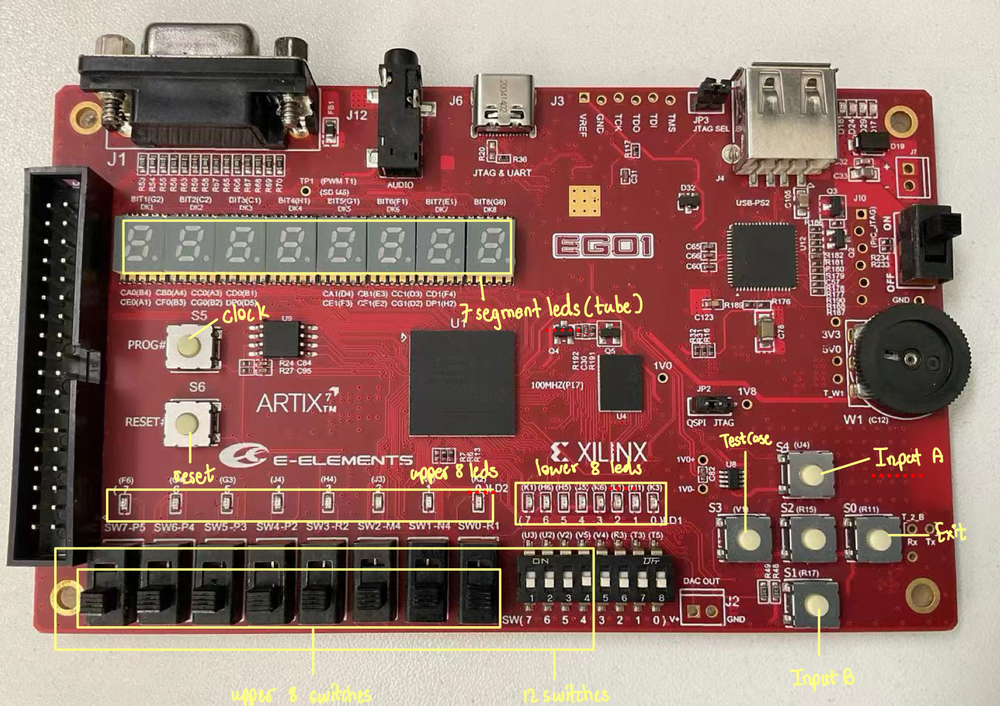

# RISC-V Single Cycle CPU

### CS202: Computer Organization Project

## Description of CPU

**CPU Type:** Single Cycle RISC-V CPU

### **Core Specifications:**

- **Instruction Set Architecture (ISA):** RISC-V (32-bit, RV32I subset). Uses 32 registers (x0-x31), each 32 bits wide.
- **Storage Scheme:** Harvard Architecture (separate instruction and data memory).
- **I/O Scheme:** Memory-Mapped I/O (MMIO).
- **CPU Clock:** 23 MHz (configurable via FPGA clock wizard).
- **Cycles Per Instruction (CPI):** 1 (single-cycle CPU).
- **Pipeline:** Not applicable (single-cycle).
- **Addressing Unit**: Data Read and Write Bits: 32 bits (4 bytes)
- **Size of Instruction Space and Data Space**: 2^14 \* 4 bytes = 64 KB
- **Base address of stack space** = 8'h00000000
- **CPU Interface:**
  - Clock: 23 MHz (FPGA clock wizard).
  - Reset: Active-high (via push button at 0xFFFFFC24).
  - Other I/O:
    - 12 DIP switches (0xFFFFFC00)
    - 4 push buttons (0xFFFFFC20 for test case, 0xFFFFFC24 for exit button, 0xFFFFFC28 for input A, 0xFFFFFC2C for input B)
    - 16 LEDs (0xFFFFFC30 for 16 leds, 0xFFFFFC40 for left )
    - 7-segment display (0xFFFFFC60)

### **Architecture Design:**

The CPU is a single-cycle processor with interconnected modules:

- **Core Modules:**

  - **CPU (Top Module):** Integrates all components and provides the external interface.
  - **IFetch (Instruction Fetch):** Fetches instructions, updates Program Counter (PC), handles branch/jump addresses.
  - **Decoder (Instruction Decode):** Decodes instructions, manages register file, generates immediates.
  - **ALU (Arithmetic Logic Unit):** Performs arithmetic (add, subtract) and logical (AND, OR, XOR, shifts, comparisons) operations.
  - **Controller:** Generates control signals based on opcode and funct fields.
  - **DataMem (Data Memory):** Handles `load`/`store` memory access.

- **I/O Modules:**

  - **MemOrIO:** Routes data between CPU, memory, and I/O devices based on address ranges (e.g., 0xFFFFFC00-0xFFFFFC7F for I/O).
  - **Switch:** Interfaces with 12 DIP switches, providing 16-bit (0xFFFFFC00) and 8-bit (0xFFFFFC10) input values.
  - **Led:** Controls 16 LED outputs, with individual control for all (0xFFFFFC30), left 8 (0xFFFFFC40), and right 8 (0xFFFFFC50).
  - **Tube:** Manages the 8-digit 7-segment display (0xFFFFFC60) for decimal/hexadecimal output.

- **Clock System:**

  - **Clock:** Global 23 MHz signal (FPGA clock wizard) synchronizes all modules.

- **Internal Connections (Data and Control Paths):**

  - **Instruction Path:** `IFetch` → `Decoder` → `Controller` → `ALU` → `IFetch` (PC updates).
  - **Data Path:** `Decoder` (register read) → `ALU` → `MemOrIO` (memory/I/O) → `Decoder` (register write).
  - **Control Signals:** `Controller` distributes signals to all modules.

- **External Interface:**
  - **Inputs:**
    - 12 DIP switches (0xFFFFFC00 for all, 0xFFFFFC10 for upper 8 switches).
    - 4 Push buttons (0xFFFFFC20 for test case selection, 0xFFFFFC24 for exit, 0xFFFFFC28 for input A, 0xFFFFFC2C for input B).
    - FPGA clock.
    - Reset signal
  - **Outputs:**
    - 16 LEDs (0xFFFFFC30 for all leds, 0xFFFFFC40 for upper 8 leds, 0xFFFFFC50 for lower 8 leds).
    - 8-digit 7-segment display (0xFFFFFC60).

## Supported Instructions

This CPU implementation supports the RISC-V RV32I base instruction set. No updates or optimizations were made beyond the baseline RV32I subset.

## R-Type Instructions (Register-Register Operations)

| Instruction         | Opcode/Format | Description                                        |
| ------------------- | ------------- | -------------------------------------------------- | --- | ---- |
| `ADD rd, rs1, rs2`  | `0110011`     | Add registers: `rd = rs1 + rs2`                    |
| `SUB rd, rs1, rs2`  | `0110011`     | Subtract registers: `rd = rs1 - rs2`               |
| `AND rd, rs1, rs2`  | `0110011`     | Bitwise AND: `rd = rs1 & rs2`                      |
| `OR rd, rs1, rs2`   | `0110011`     | Bitwise OR: `rd = rs1                              |     | rs2` |
| `XOR rd, rs1, rs2`  | `0110011`     | Bitwise XOR: `rd = rs1 ^ rs2`                      |
| `SLT rd, rs1, rs2`  | `0110011`     | Set less than (signed): `rd = (rs1 < rs2) ? 1 : 0` |
| `SLTU rd, rs1, rs2` | `0110011`     | Set less than unsigned: `rd = (rs1 < rs2) ? 1 : 0` |
| `SLL rd, rs1, rs2`  | `0110011`     | Shift left logical: `rd = rs1 << rs2[4:0]`         |
| `SRL rd, rs1, rs2`  | `0110011`     | Shift right logical: `rd = rs1 >> rs2[4:0]`        |
| `SRA rd, rs1, rs2`  | `0110011`     | Shift right arithmetic: `rd = rs1 >>> rs2[4:0]`    |

## I-Type Instructions (Immediate Operations)

| Instruction           | Opcode/Format | Description                                                               |
| --------------------- | ------------- | ------------------------------------------------------------------------- |
| `ADDI rd, rs1, imm`   | `0010011`     | Add immediate: `rd = rs1 + sign_extend(imm)`                              |
| `ANDI rd, rs1, imm`   | `0010011`     | Bitwise AND immediate: `rd = rs1 & sign_extend(imm)`                      |
| `ORI rd, rs1, imm`    | `0010011`     | Bitwise OR immediate: `rd = rs1 \| sign_extend(imm)`                      |
| `XORI rd, rs1, imm`   | `0010011`     | Bitwise XOR immediate: `rd = rs1 ^ sign_extend(imm)`                      |
| `SLTI rd, rs1, imm`   | `0010011`     | Set less than immediate (signed): `rd = (rs1 < sign_extend(imm)) ? 1 : 0` |
| `SLTIU rd, rs1, imm`  | `0010011`     | Set less than immediate unsigned: `rd = (rs1 < sign_extend(imm)) ? 1 : 0` |
| `SLLI rd, rs1, shamt` | `0010011`     | Shift left logical immediate: `rd = rs1 << shamt[4:0]`                    |
| `SRLI rd, rs1, shamt` | `0010011`     | Shift right logical immediate: `rd = rs1 >> shamt[4:0]`                   |
| `SRAI rd, rs1, shamt` | `0010011`     | Shift right arithmetic immediate: `rd = rs1 >>> shamt[4:0]`               |

## Load Instructions (I-Type Memory Access)

| Instruction           | Opcode/Format | Description                                                                    |
| --------------------- | ------------- | ------------------------------------------------------------------------------ |
| `LW rd, offset(rs1)`  | `0000011`     | Load word: `rd = memory[rs1 + sign_extend(offset)]` (32-bit)                   |
| `LB rd, offset(rs1)`  | `0000011`     | Load byte (signed): `rd = sign_extend(memory[rs1 + sign_extend(offset)][7:0])` |
| `LBU rd, offset(rs1)` | `0000011`     | Load byte unsigned: `rd = zero_extend(memory[rs1 + sign_extend(offset)][7:0])` |

## Store Instructions (S-Type Memory Access)

| Instruction           | Opcode/Format | Description                                                 |
| --------------------- | ------------- | ----------------------------------------------------------- |
| `SW rs2, offset(rs1)` | `0100011`     | Store word: `memory[rs1 + sign_extend(offset)] = rs2[31:0]` |

## Branch Instructions (B-Type Control Flow)

| Instruction             | Opcode/Format | Description                                                                       |
| ----------------------- | ------------- | --------------------------------------------------------------------------------- |
| `BEQ rs1, rs2, offset`  | `1100011`     | Branch if equal: `if (rs1 == rs2) PC = PC + sign_extend(offset)`                  |
| `BNE rs1, rs2, offset`  | `1100011`     | Branch if not equal: `if (rs1 != rs2) PC = PC + sign_extend(offset)`              |
| `BLT rs1, rs2, offset`  | `1100011`     | Branch if less than (signed): `if (rs1 < rs2) PC = PC + sign_extend(offset)`      |
| `BGE rs1, rs2, offset`  | `1100011`     | Branch if greater/equal (signed): `if (rs1 >= rs2) PC = PC + sign_extend(offset)` |
| `BLTU rs1, rs2, offset` | `1100011`     | Branch if less than unsigned: `if (rs1 < rs2) PC = PC + sign_extend(offset)`      |
| `BGEU rs1, rs2, offset` | `1100011`     | Branch if greater/equal unsigned: `if (rs1 >= rs2) PC = PC + sign_extend(offset)` |

## Jump Instructions (J-Type and I-Type Control Flow)

| Instruction            | Opcode/Format | Description                                                                  |
| ---------------------- | ------------- | ---------------------------------------------------------------------------- |
| `JAL rd, offset`       | `1101111`     | Jump and link: `rd = PC + 4; PC = PC + sign_extend(offset)`                  |
| `JALR rd, rs1, offset` | `1100111`     | Jump and link register: `rd = PC + 4; PC = (rs1 + sign_extend(offset)) & ~1` |

## Upper Immediate Instructions (U-Type)

| Instruction     | Opcode/Format | Description                                                |
| --------------- | ------------- | ---------------------------------------------------------- |
| `LUI rd, imm`   | `0110111`     | Load upper immediate: `rd = imm << 12` (lower 12 bits = 0) |
| `AUIPC rd, imm` | `0010111`     | Add upper immediate to PC: `rd = PC + (imm << 12)`         |

## I/O Memory Mapping

The CPU supports memory-mapped I/O with the following address ranges:

### Input Devices (Read Operations)

- **0xFFFFFC00**: Read all 16 switches
- **0xFFFFFC10**: Read upper 8 switches
- **0xFFFFFC20**: Read button 3 (test case)
- **0xFFFFFC24**: Read button 2 (Exit)
- **0xFFFFFC28**: Read button 0 (input A)
- **0xFFFFFC2C**: Read button 1 (input B)

### Output Devices (Write Operations)

- **0xFFFFFC30**: Control all 16 LEDs
- **0xFFFFFC40**: Control left 8 LEDs
- **0xFFFFFC50**: Control right 8 LEDs
- **0xFFFFFC60**: Control 7-segment displays

# VI. System Board Usage Instructions

**Input**-

- **Clock Button**:
  - Connected to P17 pin to send original 100MHz clock
- **Reset Button**:
  - Connected to P15 pin to reset the CPU
- **TestCase Button**:
  - Connected to V1 pin to select the testcase
- **Exit Button**:
  - Connected to R11 pin to exit from the current testcase
- **Input A Button**:
  - Connected to S4 pin in order to confirm input A value from switches
- **Input B Button**:
  - Connected to R17 pin in order to confirm input B value from switches
- **12 switches**:
  - Connected to V5 to P5 pin to get the values of 12 switches
- **8 switches**:
  - Connected to R1 to P5 pins to get the values of 8 switches

**Output** -

- **16 Leds:**

  - Connected to K3 to F6 to get the 16 bit led value

- **Upper 8 Leds:**

  - Connected to K2 to F6 to get the upper 8 bit led value

- **Lower 8 Leds:**

  - Connected to K3 to F1 to get the lower 8 bit led value

- **7 Segment Display(tube)**

  - to display hexadecimal or decimal number from testcases

## Self-Testing Instructions and Results

- **Testing Methods:** Simulation (Vivado) and on-board testing (FPGA).
- **Testing Types:** Unit tests (modules) and integration tests (full CPU).

| Test Type                                | Test Description                                                                                                                                                                                                                                                                                                     | Method     | Result |
| ---------------------------------------- | -------------------------------------------------------------------------------------------------------------------------------------------------------------------------------------------------------------------------------------------------------------------------------------------------------------------- | ---------- | ------ |
| IFetch Unit Module Testing               | Performs a basic test of the `IFetch` unit, primarily verifying its reset sequence and sequential instruction fetching by observing `inst` and `ra` outputs.                                                                                                                                                         | Simulation | Pass   |
| Decoder Unit Module Testing              | Checks the `Decoder`'s register file read/write operations, immediate value generation from instructions, and handling of I/O data.                                                                                                                                                                                  | Simulation | Pass   |
| Controller Unit Module Testing           | Tests the `Controller`'s ability to decode different instruction types and generate the correct control signals for processor operations, including memory and I/O access                                                                                                                                            | Simulation | Pass   |
| ALU Unit Module Testing                  | Verifies the `ALU` by testing various arithmetic and logical operations (R-type, I-type, branches) and checking the `aluResult` and status flags.                                                                                                                                                                    | Simulation | Pass   |
| memOrIO Module Unit Testing              | Tests the MemOrIO module by verifying memory read/write operations, I/O read (signed and unsigned) for switches, and I/O write for LEDs and 7-segment displays. Ensures correct data routing (rWdata, writeData, writeData32) and control signal generation (switchCtrl, ledCtrl, tubeCtrl) based on address ranges. | Simulation | Pass   |
| Switch Module Unit Testing               | Validates the Switch module by testing 12-bit switch input reads (full and upper 8 bits), button input reads at specific addresses (0x00, 0x10, 0x20, 0x24, 0x28, 0x2C), and data stability when switchCtrl is disabled. Verifies correct 12-bit to 16-bit mapping and sign/zero extension.                          | Simulation | Pass   |
| Led Module Unit Testing                  | Verifies the Led module by testing writes to all 16 LEDs (0x30), left 8 LEDs (0x40), right 8 LEDs (0x50), and individual LEDs (0x58, 0x59). Confirms correct LED output patterns and stability when ledCtrl is disabled.                                                                                             | Simulation | Pass   |
| Tube Module Unit Testing                 | Tests the Tube module by writing 32-bit data patterns (0x11112222, 0xABCDEF01, 0x00000000) to the 7-segment display address (0x60). Verifies correct multiplexing, segment patterns on tube0 and tube1, and digit selection via sel over multiple clock cycles.                                                      | Simulation | Pass   |
| Basic Test Scenario 1 Integrated Testing | Tested the whole functionality of CPU with assembly code of test cases from basic test scenario 1                                                                                                                                                                                                                    | On-board   | Pass   |
| Basic Test Scenario 2 Integrated Testing | Tested the whole functionality of CPU with assembly code of test cases from basic test scenario 2                                                                                                                                                                                                                    | On-board   | Pass   |

## Basic Test Scenario - 1

- Basic Test Scenario-1 are written in RISC V assembly language. => [Test Scenario-1](./asm/scenario1.asm)

| Test Case Number | Test Case Description                                                                                                                                                                                                                                                                                                                     | Result |
| ---------------- | ----------------------------------------------------------------------------------------------------------------------------------------------------------------------------------------------------------------------------------------------------------------------------------------------------------------------------------------- | ------ |
| `3'b000`         | Input the test number ‘a’, press confirm button to display the value of ‘a’ on the output device (8 LEDs), input the test number b, press confirm button to display the value of ‘b’ on the output device (8 LEDs)                                                                                                                        | Pass   |
| `3'b001`         | Input the test number ‘a’, load it in a register by ‘lb’ instruction, display the value of the 32-bit register in hexadecimal format on the output device (digital tube), and store the number to memory (in the 3'b011-3'b111 test case, the value of ‘a’ will be read from the memory unit through the ‘lw’ instruction for comparison) | Pass   |
| `3'b010`         | Input the test number ‘b’, load it in a register by ‘lbu’ instruction, display the value of the 32-bit register in hexadecimal format on the output device (digital tube), and store the number to memory (in the 3'b011-3'b111 test case, the value of ‘b’ will be read from the memory unit through the lw instruction for comparison)  | Pass   |
| `3'b011`         | Compare test number ‘a’ and test number ‘b’ (from case 1 and case 2) using ‘beq’ instruction. If the relationship holds, light up 8 LEDs. If the relationship does not hold, turn off all 8 LEDs                                                                                                                                          | Pass   |
| `3'b100`         | Compare test number ‘a’ and test number ‘b’ (from case 1 and case 2) using ‘blt’ instruction. If the relationship holds, light up 8 LEDs. If the relationship does not hold, turn off all 8 LEDs                                                                                                                                          | Pass   |
| `3'b101`         | Compare test number ‘a’ and test number ‘b’ (from case 1 and case 2) using ‘bltu’ instruction. If the relationship holds, light up 8 LEDs. If the relationship does not hold, turn off all 8 LEDs                                                                                                                                         | Pass   |
| `3'b110`         | Compare test number ‘a’ and test number ‘b’ (from case 1 and case 2) using ‘slt’ instruction, output the comparison result to the LED through the store command. If the relationship is valid, light up one LED. If the relationship is not valid, turn off the LED                                                                       | Pass   |
| `3'b111`         | Compare test number ‘a’ and test number ‘b’ (from case 1 and case 2) using ‘sltu’ instruction, output the comparison result to the LED through the store command. If the relationship is valid, light up one LED. If the relationship is not valid, turn off the LED                                                                      | Pass   |

## Basic Test Scenario - 2

- Basic Test Scenario-2 are written in assembly language. => [Test Scenario-2](./asm/scenario2.asm)

| Test Case Number | Test Case Description                                                                                                                                                                                                                                                                                                                                                                                                                                                                                                                                                                       | Result |
| ---------------- | ------------------------------------------------------------------------------------------------------------------------------------------------------------------------------------------------------------------------------------------------------------------------------------------------------------------------------------------------------------------------------------------------------------------------------------------------------------------------------------------------------------------------------------------------------------------------------------------- | ------ |
| `3'b000`         | Input an 8-bit number, reverse it, and output it. For example, input 8'b1010_1001. If not reversed, the output should be 8'b1010_1001. If reversed, the output should be 8'b1001_0101 （output the result on 8 LEDs)                                                                                                                                                                                                                                                                                                                                                                        | Pass   |
| `3'b001`         | Input an 8-bit number to determine if it is a binary palindrome (see Practice2 in Lab3). If it is a binary palindrome, turn on a led, else turn off the led.                                                                                                                                                                                                                                                                                                                                                                                                                                | Pass   |
| `3'b010`         | Input two IEEE754 encoded floating-point numbers with a width of 12 bits (the highest bit is the sign bit, the exponent is 3 bits, and the number of bits is 4 bits), with the top 8 bits (the bottom 4 bits are default to 0), and store these two floating-point numbers in memory. After inputting the first floating-point number ‘a’, press confirm button to display the decimal form of the integer part of ‘a’ on the digital tube. After inputting the second floating-point number ‘b’, press confirm to display the decimal form of the integer part of ‘b’ on the digital tube. | Pass   |
| `3'b011`         | Read out the two test data from test case ID 3'b010 in this scenario from the memory, add the two test data, and display the integer part of the sum in decimal format on the digital tube.                                                                                                                                                                                                                                                                                                                                                                                                 | Pass   |
| `3'b100`         | Input 4-bit raw data, generate its corresponding cyclic redundancy check code (CRC-4: X4+X+1), and concatenate the input data with the check code (the input data is in the high position, and the check code is in the low position). For example, if the input data is 4'b1000, the check code generated based on CRC-4 is 4'b1011, and the final output is 10001011. Display the binary form of the results on 8 LEDs.                                                                                                                                                                   | Pass   |
| `3'b101`         | Input 8-bit raw data, perform (CRC-4: X4+X+1) verification based on the input 8-bit data, and display whether the verification passes or fails through one LED light. For example, if you enter 8'b10001011 and the verification passes, one LED light will turn on. If you enter 8'b10001010 and the verification fails, the LED light will turn off.                                                                                                                                                                                                                                      | Pass   |
| `3'b110`         | Please design your own test case to test whether the “lui” instruction is effective on your CPU. Use a digital tube for output. (If this instruction is not designed in other ISAs implemented, consider implementing similar functionality in other ways and testing)                                                                                                                                                                                                                                                                                                                      | Pass   |
| `3'b111`         | Please design your own test cases to test whether “jal” and “jalr” instructions are effective. (If this instruction is not designed in other ISAs implemented, consider implementing similar functionality in other ways and testing)                                                                                                                                                                                                                                                                                                                                                       | Pass   |

- **Conclusion:** All tests passed, confirming the CPU’s functionality for RV32I instructions and I/O operations.

## Contribution

| Contributor  | CPU Design & Implementation(in Verilog) | RISC-V Assembly Code | Report |
| ------------ | --------------------------------------- | -------------------- | ------ |
| Wai Yan Kyaw | ✔️                                      | ✔️                   | ✔️     |
| Sean Sovann  | ✔️                                      | ✔️                   | ✔️     |
